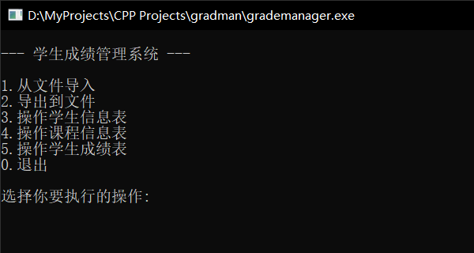

## C++ 学生成绩管理系统

### 简介
- - - - - - - - - - - -

本项目是计科的一项实践作业，使用 C++ 语言开发，实现了**学生信息表**、**课程信息表**和**学生成绩表**的管理以及数据导入导出等功能。  
本项目的 [github 地址](https://github.com/I0me0I/grade-manager-cpp)

### 使用说明
- - - - - - - - - - - -

#### 启动界面



启动主程序（main.cpp）后会看到上面的界面，输入数字，选择你想要执行的操作。

1. 从文件导入  
输入文件名来导入数据，文件不存在或无法访问则导入失败。

2. 导出到文件
输入文件名来导出数据，文件无法访问则导出失败。如果文件已存在，导出的数据会覆盖文件内容。

#### 学生信息表


> 注意：初始时学生信息表为空，应当先**添加记录**或返回上一界面并选择**从文件导入**。

1. 显示记录  
这里可以看到所有添加的学生记录，按<kbd>1</kbd>和<kbd>2</kbd>翻页。

2. 添加记录  
输入相关信息来添加学生记录，记录重复或者数据类型或范围不正确会添加失败。

3. 删除记录  
输入学号来删除学生记录。

4. 修改记录  
输入学号来修改学生记录。

5. 查询记录  
输入相关信息来查询学生记录。按<kbd>1</kbd>和<kbd>2</kbd>键翻页。

#### 课程信息表

（同上）

#### 学生成绩表

（同上）

### 开发环境
- - - - - - - - - - - -

* MinGW-W64 8.1.0
* VSCode 1.77.3

### 项目内容
- - - - - - - - - - - -

#### 文件列表

该项目的文件列表如下：

    .vscode                  // vscode 配置文件
    |--c_cpp_properties.json
    |--launch.json
    |--settings.json
    |--tasks.json
    header                   // c++ 头文件
    |--common.h
    |--record.h
    |--table.h
    |--manager.h
    source                   // c++ 源文件
    |--common.cpp
    |--student.cpp
    |--course.cpp
    |--grade.cpp
    |--manager.cpp
    |--main.cpp
    diagram                  // 用 draw.io 编写的图的源文件
    |--files.drawio
    img                      // 图片
    |--manager.png
    |--table.png
    |--files.svg
    |--example.gif
    readme.md                // 本文档的 markdown 源文件
    报告.html                // 本文档的 html 版本
    报告.pdf                 // 本文档的 pdf 版本

其中`source`文件夹包含了本项目所有的 c++ 源文件。如果安装了 g++ 编译器但没有 vscode，可以使用下面的命令编译并链接：

```shell
cd /path/to/project
g++ -g ./source/*.cpp -o grademanager.exe -fexec-charset=GBK
```

项目报告使用 markdown 编写，为了便于老师阅读，已转换为 html 和 pdf 格式（即`报告.html`和`报告.pdf`），建议阅读 html 版本。  
下面的功能框图使用 draw.io 编写，并转换为了 svg 格式  

#### 项目文件依赖

本项目各头文件及源文件的依赖关系如图：


#### 功能实现

`Manager`类（定义于 manager.h）实现了学生成绩管理系统的主菜单界面及导入导出功能。  
`Table`模板类（定义于 table.h）实现了表的通用操作及管理功能。  
`Student`类、`Course`类和`Grade`类（均定义于 record.h）分别实现了学生信息、课程信息和学生成绩的记录类型的基本操作。

（详细内容见代码）

### 使用示例

> 注意：如果本文档为 PDF 格式，下面的 GIF 图片无法正确显示

